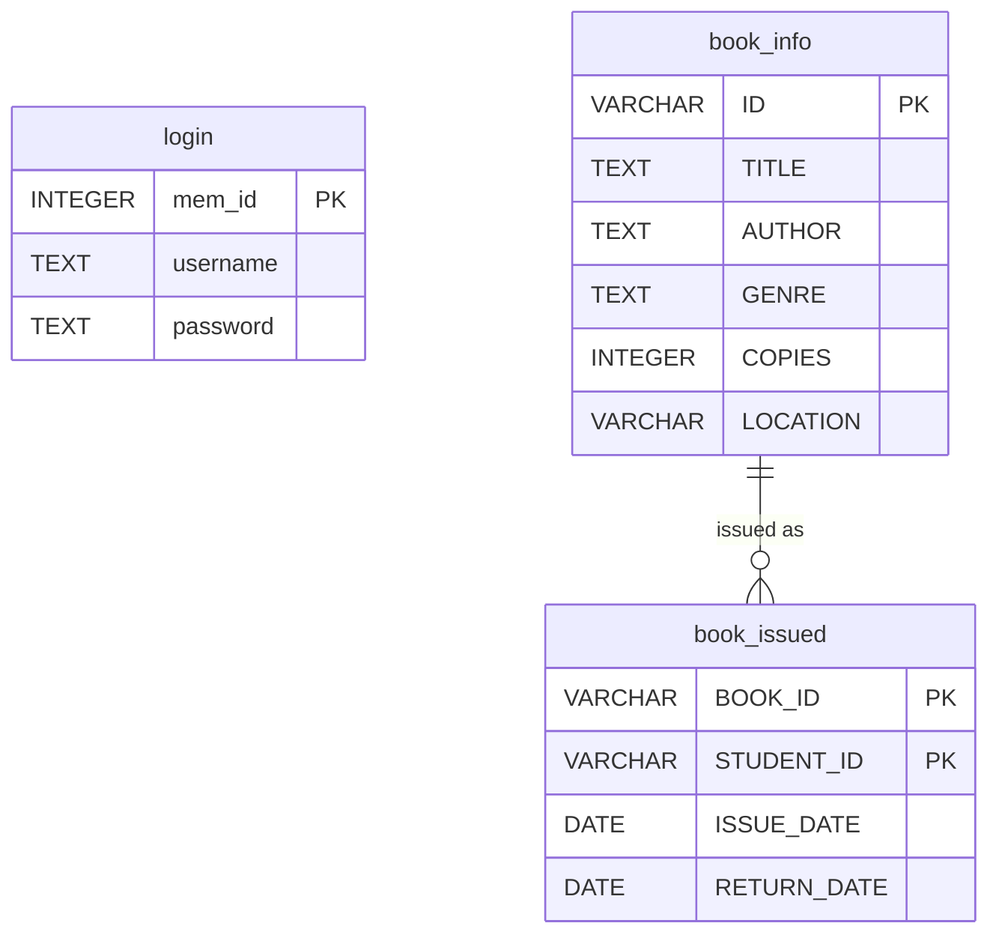

# 📚 Library Management System

A desktop **Library Management System** built with Python, Tkinter, and SQLite. Features an admin login, full CRUD operations for books, and a student book-issuing workflow with due-date tracking.


---

## ✨ Features

| Module | Capabilities |
|---|---|
| **Authentication** | Secure admin login with SHA-256 hashed passwords |
| **Book Management** | Add, search, view all, update copies, delete books |
| **Student Management** | Issue books, return books, track student activity |
| **Data Persistence** | SQLite database with auto-initialization |

---

## 📸 Screenshots

**Home Screen**


**Book Data**


**Student Data**


---

## 🛠️ Tech Stack

- **Language:** Python 3.8+
- **GUI Framework:** Tkinter
- **Image Processing:** Pillow
- **Database:** SQLite3
- **Security:** SHA-256 password hashing (hashlib)

---

## 🚀 Getting Started

### Prerequisites

- Python 3.8 or higher
- pip (Python package manager)

### Installation

1. **Clone the repository**
   ```bash
   git clone https://github.com/Mansha0805/Library-Management-System.git
   cd Library-Management-System
   ```

2. **Install dependencies**
   ```bash
   pip install -r requirements.txt
   ```

3. **Run the application**
   ```bash
   python main.py
   ```

4. **Login with default credentials**
   | Username | Password |
   |----------|----------|
   | `admin`  | `admin`  |

---

## 📁 Project Structure

```
Library-Management-System/
├── assets/              # Background images
│   ├── finance.png
│   ├── image2.png
│   └── library.png
├── app.py               # Tkinter GUI (LibraryApp class)
├── db.py                # Database layer (SQLite CRUD + auth)
├── main.py              # Application entry point
├── requirements.txt     # Python dependencies
├── .gitignore
├── LICENSE
└── README.md
```

---

## 📊 Database Schema



---

## 🤝 Contributing

1. Fork the repository
2. Create a feature branch (`git checkout -b feature/your-feature`)
3. Commit your changes (`git commit -m 'Add your feature'`)
4. Push to the branch (`git push origin feature/your-feature`)
5. Open a Pull Request

---

## 📄 License

This project is licensed under the MIT License — see the [LICENSE](LICENSE) file for details.
